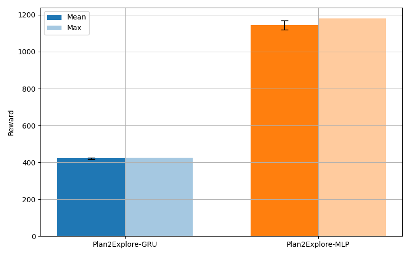

# Plan2Explore: Активное обучение с подкреплением и планированием

## Обзор

Этот проект — реализация идеи Plan2Explore: обучение с подкреплением без внешней награды, где агент исследует среду, ориентируясь на неопределённость своих предсказаний. В основе — ансамбль моделей мира (world model), различия между которыми служат внутренним вознаграждением.

## Основные идеи

- Агент использует две модели мира (GRU и MLP), чтобы предсказывать поведение среды.
- В качестве внутренней награды используется стандартное отклонение между предсказаниями этих моделей.
- Планирование осуществляется в латентном пространстве без внешнего сигнала награды.
- Эксперименты показали, что простая модель (MLP) может быть эффективнее сложной (GRU) для генерации разнообразного поведения.

## Эксперименты

Среда: **Cheetah Run** из DeepMind Control Suite.  
Сравниваются два варианта агента:
- Plan2Explore-GRU (world model с памятью)
- Plan2Explore-MLP (простая полносвязная сеть)

Результаты:
- MLP-агент показал награду в среднем в 2.3 раза выше, чем GRU.
- GRU-сеть выравнивала предсказания, снижая внутреннее вознаграждение и ухудшая исследовательское поведение.
- Агент с MLP активнее исследует среду, что видно и по кривой награды, и по поведению.



## Установка

```bash
git clone https://github.com/dolganin/GRUmer.git
cd GRUmer
pip install -r requirements.txt
```

## Запуск

```bash
python main.py
```

Будут запущены две версии эксперимента (с GRU и без), сохранены награды и построен сравнительный график.

## Лицензия

Проект распространяется под лицензией MIT. См. файл [LICENSE](LICENSE).

## Выводы

Агент с введением в условия память хуже справляется с поиском новых методов наращивания награды. Скорее всего, это вызано тем, что агент пытается полагаться на изученные ранее методы повышения награды, то есть, появление памяти, которая позволяет агенту сохранять предыдущие состояние долгое время, приводит к уменьшению его "любопытства".

## Ссылки

- [Plan2Explore (NeurIPS 2020)](https://arxiv.org/abs/2005.05960)
- [DeepMind Control Suite](https://arxiv.org/abs/1801.00690)
